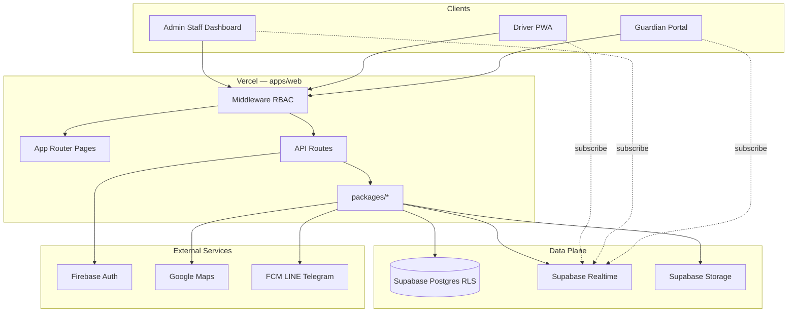

# System Overview

High-level architecture for CMT Fleet Transit: clients, application layer, data plane, and external services. Supports multi-tenant B2B SaaS at pilot scale on a free-tier stack.

---

## Architecture Diagram

```
┌─────────────────────────────────────────────────────────────────────────────┐
│                              CLIENTS                                         │
├──────────────────┬────────────────────┬─────────────────────────────────────┤
│  Admin / Staff   │  Driver PWA        │  Parent / Guardian PWA              │
│  Dashboard       │  (mobile browser)  │  (tracking + notifications)       │
│  Next.js pages   │  geolocation API   │  map view, push tokens              │
└────────┬─────────┴─────────┬──────────┴──────────────┬──────────────────────┘
         │                   │                         │
         │         HTTPS (Vercel — apps/web)           │
         ▼                   ▼                         ▼
┌─────────────────────────────────────────────────────────────────────────────┐
│                         APPLICATION LAYER                                      │
│  Next.js 14 App Router — apps/web                                            │
├─────────────────────────────────────────────────────────────────────────────┤
│  Pages          │ /dashboard/*  /parent/*  /auth/*  /driver/* (routes)     │
│  Middleware     │ Session verify · RBAC · org context                        │
│  API Routes     │ /api/auth/*  /api/routes/optimize  /api/trips/*  …       │
│  Server libs    │ supabase-server · session · Firebase admin                 │
├─────────────────────────────────────────────────────────────────────────────┤
│  packages/auth          Firebase client/admin · LINE · RBAC helpers           │
│  packages/shared        Types · Zod schemas · constants · errors            │
│  packages/routing       Clarke-Wright · Distance Matrix · LRU cache         │
│  packages/notifications Telegram · LINE · FCM · notification-service        │
│  packages/storage       Supabase client · adapter pattern                     │
└────────┬────────────────────────────┬───────────────────────┬───────────────┘
         │                            │                       │
         ▼                            ▼                       ▼
┌─────────────────┐    ┌──────────────────────────┐    ┌─────────────────────┐
│   Firebase      │    │   Supabase               │    │   Google Maps       │
│   Phone Auth    │    │   PostgreSQL + RLS       │    │   Distance Matrix   │
│   Custom claims │    │   Realtime (WSS)         │    │   Directions API    │
│                 │    │   Storage (photos)       │    │   Maps JavaScript   │
└─────────────────┘    └──────────────────────────┘    └─────────────────────┘
         │                            │                       │
         │                            │                       │
         └────────────────────────────┼───────────────────────┘
                                      ▼
                         ┌────────────────────────┐
                         │  Notification providers  │
                         │  FCM · LINE · Telegram   │
                         └────────────────────────┘
```

---

## Mermaid View



---

## Layer Responsibilities

| Layer | Responsibility | Does not |
|-------|----------------|----------|
| **Clients** | Render UI, capture GPS/camera, hold session cookies | Direct DB access without RLS context |
| **Middleware** | Auth gate, role routing, CSRF cookie policy | Business logic |
| **API routes** | Orchestration, validation, call packages | Duplicate routing algorithm in UI |
| **packages/** | Domain logic reusable across apps | Import React components |
| **Supabase** | Persistence, realtime fanout, file storage | Phone OTP (Firebase handles) |
| **Firebase** | Identity proof (phone, LINE token exchange) | Fleet entity storage |
| **Google Maps** | Distances, directions, map tiles | Route optimization logic |
| **Notifications** | Deliver templated messages | Store passenger records |

---

## Request Flow — Authentication

```
Guardian/Driver/Admin
        │
        ▼
  Firebase Phone OTP (or LINE OAuth)
        │
        ▼
  POST /api/auth/verify
        │
        ├── Set custom claims (role, organization_id)
        ├── Upsert user profile in Supabase
        └── Issue session cookie (HTTP-only)
        │
        ▼
  Middleware on next request
        │
        ├── Verify session
        ├── Load Supabase server client with user JWT
        └── RLS applies organization scope
```

---

## Request Flow — Live GPS

```
Driver PWA (active trip)
        │
        ▼  every ~5s
  navigator.geolocation
        │
        ▼
  INSERT locations (trip_id, lat, lng, recorded_at)
        │
        ▼
  Supabase Realtime broadcast
        │
        ├── Dashboard map subscriber (Admin/Staff)
        └── Guardian tracking subscriber (scoped trip)
```

**Target:** < 100ms p95 subscriber receive ([NFR-P02](../requirements/non-functional-requirements.md)).

---

## Request Flow — Check-In + Notification

```
Driver enters OTP → POST check-in API
        │
        ├── Validate OTP against passenger record
        ├── Write check_ins row + GPS coordinates
        ├── Optional: upload photo → Supabase Storage
        ├── Write audit_log entry
        └── Emit notification event
                │
                ▼
        packages/notifications
                │
        ┌───────┼───────┐
        ▼       ▼       ▼
       FCM    LINE  Telegram
        │
        ▼
  Guardian device (< 30s target)
```

---

## Request Flow — Route Optimization

```
Admin clicks Optimize
        │
        ▼
  POST /api/routes/optimize
        │
        ├── Zod validate stops + capacity
        ├── packages/routing: Distance Matrix (cached)
        ├── Clarke-Wright + 2-opt
        └── Return ordered stops + estimates
        │
        ▼
  Admin applies order → save route_stops
```

**Target:** < 2s for 50 stops ([NFR-P01](../requirements/non-functional-requirements.md)).

---

## Multi-Tenant Boundary

```
┌─────────────────────────────────────────┐
│  Organization A          Organization B    │
│  ┌─────────────┐        ┌─────────────┐ │
│  │ schools     │        │ schools     │ │
│  │ passengers  │   ╳    │ passengers  │ │
│  │ trips       │        │ trips       │ │
│  └─────────────┘        └─────────────┘ │
│         ▲                      ▲         │
│         └──────── RLS ─────────┘         │
│              organization_id             │
└─────────────────────────────────────────┘
```

Every API call carries authenticated user context; Postgres RLS is the last line of defense ([E1](../requirements/mvp-backlog.md)).

---

## Deployment Topology

| Environment | Web | Database | Auth |
|-------------|-----|----------|------|
| **Local** | `pnpm dev` localhost:3000 | Supabase local or dev project | Firebase dev |
| **Staging** | Vercel preview | Supabase staging project | Firebase staging |
| **Production** | Vercel production | Supabase prod project | Firebase prod |

Single Next.js app (`apps/web`) serves Admin, Staff, Driver, and Guardian routes. `apps/driver` is a thin Capacitor shell (P2) wrapping same web routes — not separate backend.

---

## Security Perimeter

| Control | Where |
|---------|-------|
| TLS | Vercel edge |
| Session cookies | `HttpOnly`, `Secure`, `SameSite` |
| RBAC | Middleware + API route guards |
| Tenant isolation | Supabase RLS |
| Rate limiting | API middleware (10/min/IP public) |
| Input validation | Zod in `packages/shared` |
| CSP | Next.js headers |
| Secrets | Environment variables only; `check-secrets.sh` |

---

## Scalability Notes (Pilot)

| Component | Pilot assumption | Scale trigger |
|-----------|------------------|---------------|
| Vercel serverless | Low concurrent API | Upgrade plan if cold starts hurt |
| Supabase Realtime | ≤ 20 active trips | Connection limits on free tier |
| Postgres | ≤ 500 passengers/org | Indexes + read replicas later |
| Maps API | LRU cache | Billing alert at 80% quota |

Detail in [tech-stack.md](tech-stack.md) and [integration-map.md](integration-map.md).

---

## Epic Mapping

| System area | MVP epics |
|-------------|-----------|
| Auth + tenancy | E1 |
| Fleet CRUD API + pages | E2 |
| Optimizer API | E3 |
| Trip + GPS | E4, E6 |
| Check-in pipeline | E5 |
| Guardian + notifications | E7, E8 |

---

## Related Documents

- [Tech stack](tech-stack.md)
- [Monorepo structure](monorepo-structure.md)
- [Integration map](integration-map.md)
- [MVP backlog](../requirements/mvp-backlog.md)
