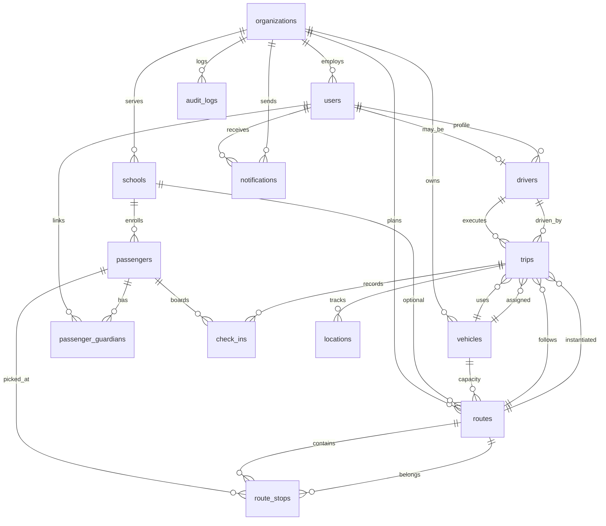

# Entity-Relationship Diagram

Logical data model for CMT Fleet Transit. All tenant data hangs off **organizations** — a bus vendor or operator account serving one or more schools.

**Notation:** `1—*` one-to-many · `*—*` many-to-many

---

## High-Level ERD



---

## ASCII Overview

```
                    ┌─────────────────┐
                    │  organizations  │  ← tenant root
                    └────────┬────────┘
         ┌───────────────────┼───────────────────┐
         ▼                   ▼                   ▼
   ┌──────────┐       ┌──────────┐       ┌──────────┐
   │  users   │       │ schools  │       │ vehicles │
   └────┬─────┘       └────┬─────┘       └────┬─────┘
        │                  │                  │
        │            ┌───────┴───────┐          │
        ▼            ▼               ▼          ▼
   ┌─────────┐  ┌───────────┐  ┌─────────┐  ┌────────┐
   │ drivers │  │ passengers│  │ routes  │  │ trips  │
   └────┬────┘  └─────┬─────┘  └────┬────┘  └───┬────┘
        │             │               │           │
        │      ┌──────┴──────┐        ▼           │
        │      ▼             ▼   ┌───────────┐   │
        │  passenger_    route_stops            │
        │  guardians         │                  │
        │                    │                  ▼
        └────────────────────┴──────► check_ins │
                                      locations │
                                      notifications
                                      audit_logs
```

---

## Entity Definitions

### organizations

Root tenant. One record per bus vendor or operator customer.

| Relationship | To |
|--------------|-----|
| 1 — * | users, schools, vehicles, routes, trips (via children), audit_logs, notifications |

**Key attributes:** `name`, `status`, notification config (LINE token, Telegram bot), `photo_proof_required`

---

### users

Authenticated person. Linked to Firebase `firebase_uid`. Role determines RLS access.

| Relationship | To |
|--------------|-----|
| * — 1 | organizations |
| 1 — 0..1 | drivers (when role = driver) |
| 1 — * | passenger_guardians (when role = parent) |
| 1 — * | notifications, audit_logs |

**Roles:** `superadmin`, `admin`, `staff`, `driver`, `parent`

---

### schools

School or site served by the organization.

| Relationship | To |
|--------------|-----|
| * — 1 | organizations |
| 1 — * | passengers, routes (optional FK) |

---

### vehicles

Fleet unit with seat capacity.

| Relationship | To |
|--------------|-----|
| * — 1 | organizations |
| 1 — * | trips, routes (default vehicle) |

**Key attributes:** `label`, `license_plate`, `seat_capacity`, `status`

---

### drivers

Driver profile extending a user.

| Relationship | To |
|--------------|-----|
| * — 1 | users, organizations |
| 1 — * | trips |

---

### passengers

Rider (often minor). Not a login user.

| Relationship | To |
|--------------|-----|
| * — 1 | organizations, schools |
| 1 — * | passenger_guardians, route_stops, check_ins |

**Key attributes:** `otp_secret`, `default_stop_id`, `status`

---

### passenger_guardians

Junction: which guardian users are linked to which passengers.

| Relationship | To |
|--------------|-----|
| * — 1 | passengers, users (guardian) |

Enforces guardian-scoped RLS for tracking and notifications.

---

### routes

Reusable route template with ordered stops.

| Relationship | To |
|--------------|-----|
| * — 1 | organizations, schools (optional), vehicles (capacity ref) |
| 1 — * | route_stops, trips |

**Key attributes:** `name`, `direction` (pickup/dropoff), `total_distance_m`, `estimated_duration_s`

---

### route_stops

Ordered stop on a route. May reference a passenger pickup point or geocoded address.

| Relationship | To |
|--------------|-----|
| * — 1 | routes, organizations |
| * — 0..1 | passengers |

**Key attributes:** `sequence`, `lat`, `lng`, `address_label`

---

### trips

Single scheduled or active execution of a route.

| Relationship | To |
|--------------|-----|
| * — 1 | organizations, routes, drivers, vehicles |
| 1 — * | check_ins, locations |

**Status:** `scheduled` → `active` → `completed` | `cancelled`

---

### check_ins

Passenger boarding or alighting event (OTP-verified).

| Relationship | To |
|--------------|-----|
| * — 1 | trips, passengers, organizations, route_stops (optional) |
| * — 1 | users (driver who recorded) |

**Types:** `pickup`, `dropoff`  
**Optional:** `photo_url`, `lat`, `lng`

---

### locations

GPS sample during an active trip (high volume).

| Relationship | To |
|--------------|-----|
| * — 1 | trips, organizations |
| * — 0..1 | drivers |

**Key attributes:** `lat`, `lng`, `recorded_at`, `heading`, `speed`

Realtime subscribers listen on `trip_id`.

---

### notifications

Outbound message delivery log.

| Relationship | To |
|--------------|-----|
| * — 1 | organizations, users (recipient) |
| * — 0..1 | trips, passengers, check_ins |

**Channels:** `fcm`, `line`, `telegram`  
**Status:** `pending`, `sent`, `failed`

---

### audit_logs

Immutable record of mutations and privileged actions.

| Relationship | To |
|--------------|-----|
| * — 1 | organizations |
| * — 0..1 | users (actor) |

**Key attributes:** `action`, `entity_type`, `entity_id`, `metadata` (JSONB)

---

## Cardinality Summary

| From | To | Cardinality | Notes |
|------|-----|-------------|-------|
| organization | school | 1:N | Vendor serves many schools |
| organization | user | 1:N | All staff scoped to org |
| user | driver | 1:0..1 | Driver role only |
| user | passenger (guardian) | N:M | Via `passenger_guardians` |
| school | passenger | 1:N | |
| route | route_stop | 1:N | Ordered by `sequence` |
| route | trip | 1:N | Same route, many days |
| trip | check_in | 1:N | Multiple passengers per trip |
| trip | location | 1:N | Many GPS points per trip |
| passenger | check_in | 1:N | History across trips |

---

## Tenant Key Propagation

Every tenant table includes `organization_id UUID NOT NULL REFERENCES organizations(id)`.

```
organizations.id
    └── users.organization_id
    └── schools.organization_id
    └── vehicles.organization_id
    └── passengers.organization_id
    └── routes.organization_id
    └── route_stops.organization_id
    └── trips.organization_id
    └── check_ins.organization_id
    └── locations.organization_id
    └── notifications.organization_id
    └── audit_logs.organization_id
```

Child FKs (e.g. `trips.route_id`) must reference rows with **matching** `organization_id` — enforced by application logic and composite RLS policies.

---

## Domain Boundaries

| Inside Postgres | Outside Postgres |
|-----------------|------------------|
| Fleet entities, trips, events | Firebase identity proof |
| GPS history | Google Maps distances (cached in app) |
| Notification log | FCM/LINE/Telegram delivery |
| Photo metadata + URL | Binary in Supabase Storage bucket |

---

## Mapping to MVP Epics

| Epic | Primary entities |
|------|------------------|
| E1 Tenancy | organizations, users |
| E2 Fleet | schools, vehicles, drivers, passengers, passenger_guardians |
| E3 Routes | routes, route_stops |
| E4 Trips | trips, locations |
| E5 Check-in | check_ins |
| E8 Notifications | notifications |
| E12 Audit | audit_logs |

---

## Related Documents

- [Schema](schema.md) — column-level definitions
- [RLS policies](rls-policies.md)
- [Indexes](indexes.md)
- [Architecture ADR-001](../architecture/adr/001-supabase-postgres-rls.md)
